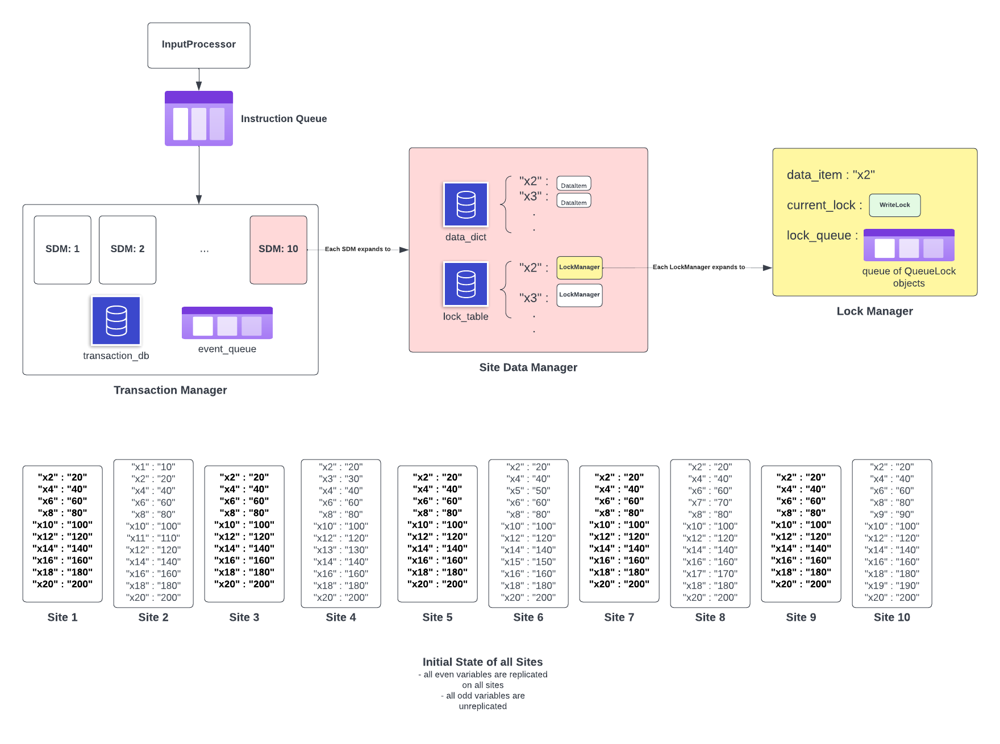

# RepCRec

## Overview
- This project is an implementation of a distributed database system with deadlock detection, replication, and failure recovery. 
- This project emulates the Available Copies algorithm.
- Read-Write Transactions operate on strict Two-Phase Locking with validation checks at commit time.
- Read-Only Transactions operate on Multiversion Read Consistency.

### Project Structure



### Available Copies Algorithm

- Read from one copy, but write to all copies.  
- When a transaction cannot read _x_ from a site, read it from another site. If the transaction cannot read _x_ from any site, it will wait. 
- When writing, if a transaction cannot write to a site containing _x_, write to all other available sites, provided there is at least one.
- At commit time, for a transaction T (R/W)- check whether all sites T accessed (R or W) have been up since T first accessed them. If not, T aborts.
- Read-Only transactions do not abort since they use Multiversion Read Consistency (see below).
- When a site recovers, all unreplicated data is available for R and W. Replicated data items are available for W, but not for R- not until a transaction commits a value to it.

### Multiversion Read Consistency

- A Read-Only transaction obtains no locks- instead, it reads the committed value of data items at the time the transaction began. It essentially reads from a snapshot at transaction start-time. 
- Since RO-transactions dont acquire locks, they will never be a part of a waits-for-cycle, and subsequently a deadlock. Hence, RO transactions never have to abort.

### Two Phase Locking
- Get locks on data items as and when you need them, but do not release locks until the transaction commits/aborts.
- The _lockpoint_ of a transaction is the earliest time that a transaction holds all its locks. 
- Blocking/Waits-For Graph: T -> T' if T needs a lock on item _x_ which T' is currently holding the lock for. T' is ahead of T in the wait-queue for _x_.
- Multiple transactions can share read-locks, so long as the transaction doesn't skip over a write transaction in the wait-queue.
- A transaction can promote its read lock on _x_ to a write lock, if the first queued write request in the wait-queue is from the same transaction, and no other transactions are currently sharing the read lock with the transaction.
- When a deadlock is detected, the youngest transaction in the cycle is aborted. 
- To prevent needless deadlocks, the write of a replicated variable should not acquire a lock on any site unless it can acquire a lock on all the sites containing that variable.

### Other Rules

- While a transaction is waiting, it will not receive any other instructions.
- At any given point in time, all sites cannot be down.
- Every tick can only have one instruction.
- No two transactions will have the same age.
- An aborted transaction will receive no further instructions. 
- When a transaction T write to _xi_, and following read of _xi_ from the same transaction retuns the new value T wrote to _xi_. However, no other transaction can read this value unless T commits and the value is written to the DB.
- A transaction cannot issue a commit with unresolved queued lock requests. 
- Each line with have one of : `read() / begin() / beginRO() / write() / fail() / recover() / dump() / end()`
- When a transaction isn't able to read from any site, it waits. During this time, it does **not** hold read locks on any item. For example, if all but one sites are down for replicated x2 (site 1 is up), and say site 1 was previously down, and recovered, now transaction T technically cannot read from any site. So it waits. And since it doesn't hold a read lock on x2.1, another transaction can come in, commit to x2.1 and now transaction T can read from it.
- Write to all available sites when the Write command was executed, not when the Write command was issued. Since a Write might need to wait for another transaction to release its locks- in which case, the Write time != Write issue time.
- All the writes of a committing transaction happen, or none do.
- When a site fails, clear the lock tables and queued lock requests. 
- Check for deadlocks at the start of each tick. So if a deadlock actually happens at `tick=t`, the deadlock is detected at `tick=t+1`
- When a transaction believes a site is down, all sites must agree - no network partitions.
- Multiple transactions can wait for a site to come back up. 
- When a transaction has to abort, it aborts when `end()` is called.
- A Transaction T writing to a replicated variable, need not write to every site that contains the variable for it to commit safely.

### Example Testcase

```
//Reading non replicated variable when the site is down at RO transaction start
// In this case, the read waits, but the site later comes back up and both queued reads happen.
// We also have T4 which tries to read a replicated variable from a site that went down and came back up
// T4 just waits, and it also allowed to commit.
begin(T1)
R(T1,x2)
begin(T4)
fail(2) //x1 is contained in site 2
beginRO(T2)
beginRO(T3)
R(T2,x1) //this waits
R(T3,x11) // this should also wait.
recover(2) //Do both T2 and T3 read at this point? Yes, both T2 and T3 read at this point.
end(T2) //These 3 should commit.
end(T3)
end(T1)
fail(1) //Make sure all other sites fail now, so only site 2 is up
fail(3)
fail(4)
fail(5)
fail(6)
fail(7)
fail(8)
fail(9)
fail(10)
R(T4,x4) //Reading this replicated variable should not be allowed - it should just wait cuz T4 cant read it from anywhere else
end(T4) //This also commits fine.
```

### Output for sample testcase

```
Instruction Queue: 
deque([('begin', begin(T1)), ('R', R(T1,x2)), ('begin', begin(T4)), ('fail', fail(2)), ('beginRO', beginRO(T2)), ('beginRO', beginRO(T3)), ('R', R(T2,x1)), ('R', R(T3,x11)), ('recover', recover(2)), ('end', end(T2)), ('end', end(T3)), ('end', end(T1)), ('fail', fail(1)), ('fail', fail(3)), ('fail', fail(4)), ('fail', fail(5)), ('fail', fail(6)), ('fail', fail(7)), ('fail', fail(8)), ('fail', fail(9)), ('fail', fail(10)), ('R', R(T4,x4)), ('end', end(T4))])

Execution:
-------- time:0 --------
Transaction T1 starts
-------- time:1 --------
T1 reads x2.1 : 20
-------- time:2 --------
Transaction T4 starts
-------- time:3 --------
Site 2 fails
-------- time:4 --------
Transaction T2 [Read Only] starts
-------- time:5 --------
Transaction T3 [Read Only] starts
-------- time:6 --------
-------- time:7 --------
-------- time:8 --------
Site 2 recovers
T2 [Read-Only] reads x1.2 : 10
T3 [Read-Only] reads x11.2 : 110
-------- time:9 --------
Transaction T2 commits
-------- time:10 --------
Transaction T3 commits
-------- time:11 --------
Transaction T1 commits
-------- time:12 --------
Site 1 fails
-------- time:13 --------
Site 3 fails
-------- time:14 --------
Site 4 fails
-------- time:15 --------
Site 5 fails
-------- time:16 --------
Site 6 fails
-------- time:17 --------
Site 7 fails
-------- time:18 --------
Site 8 fails
-------- time:19 --------
Site 9 fails
-------- time:20 --------
Site 10 fails
-------- time:21 --------
-------- time:22 --------
Transaction T4 commits

```
